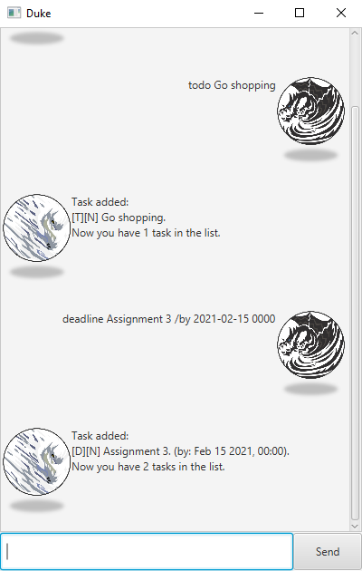

# Duke User Guide



## Features 

Duke is a chat bot that can help you to manage tasks.

## Usage

### `todo` - Add a todo task

Add a todo task with user's description. The task will be added to the list.

Format: `todo DESCRIPTION`

Example of usage: 

```
todo Go shopping
```

Expected outcome:

```
Task added:
[T][N] Go shopping.
Now you have 1 task in the list.
```

### `event` - Add an event task

Add an event task with user's description. The task will be added to the list.

Format: `event DESCRIPTION /at yyyy-MM-dd HHmm`

Example of usage: 

```
event Meeting /at 2020-02-20 2000
```

Expected outcome:

```
Task added:
[E][N] Meeting. (at: Feb 20 2020, 20:00).
Now you have 2 task in the list.
```

### `deadline` - Add a deadline task

Add a deadline task with user's description. The task will be added to the list.

Format: `deadline DESCRIPTION /by yyyy-MM-dd HHmm`

Example of usage: 

```
deadline Assignment /by 2020-02-20 1200
```

Expected outcome:

```
Task added:
[D][N] Assignment. (at: Feb 20 2020, 12:00).
Now you have 3 task in the list.
```

### `list` - Show all tasks added

Show all tasks have been added.

Format: `list`

Example of usage: 

```
list
```

Expected outcome:

```
1.[T][N] Go shopping.
2.[E][N] Meeting. (at: Feb 20 2020, 20:00).
3.[D][N] Assignment. (at: Feb 20 2020, 12:00).
```

### `done` - Mark a task as done

Mark the task at the specified index as done.

Format: `done INDEX`

Example of usage: 

```
done 1
```

Expected outcome:

```
This task is marked as done:
[T][Y] Go shopping.
```

### `delete` - Delete the task from the list

Delete the task at the specified index.

Format: `delete INDEX`

Example of usage: 

```
delete 2
```

Expected outcome:

```
This task is deleted:
[E][N] Meeting. (at: Feb 20 2020, 20:00).
Now you have 2 tasks in the list.
```

### `find` - Find the task from the list with given keyword

Find tasks that contains the given keyword from the list.

Format: `find KEYWORD`

Example of usage: 

```
find Go
```

Expected outcome:

```
Here are the matching tasks in the list:
1.[T][Y] Go shopping.
```

### `go` - Add a place

Add a place with user's description. The place will be added to another list.

Format: `go PLACE /do DESCRIPTION`

Example of usage: 

```
go NUS /do Lecture
```

Expected outcome:

```
Place added:
Lecture: NUS
Now you have 1 place in the list.
```

### `place` - List all places

Show all places have been added.

Format: `place`

Example of usage: 

```
place
```

Expected outcome:

```
Lecture: NUS
```

### `bye` - Close Duke

Close Duke and save.

Format: `bye`

Example of usage: 

```
bye
```

Expected outcome: Duke will save all data and exit.


## Author

Wang Yuanzhe